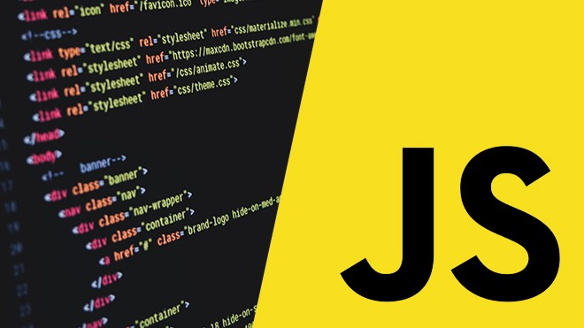

### Hola Mundo, soy Juan Valdivia

- 👋 Hi, I’m @JuanDNJ
- 👀 I’m interested in Jobs
- 🌱 I’m currently learning Barcelona Activa , Front End, React
- 💞️ I’m looking to collaborate on ...
- 📫 How to reach me ...

 

#### Thanks for visiting :heart:

⭐️ From [JuanDNJ](https://github.com/juandnj)
<!---
JuanDNJ/JuanDNJ is a ✨ special ✨ repository because its `README.md` (this file) appears on your GitHub profile.
You can click the Preview link to take a look at your changes.
--->
